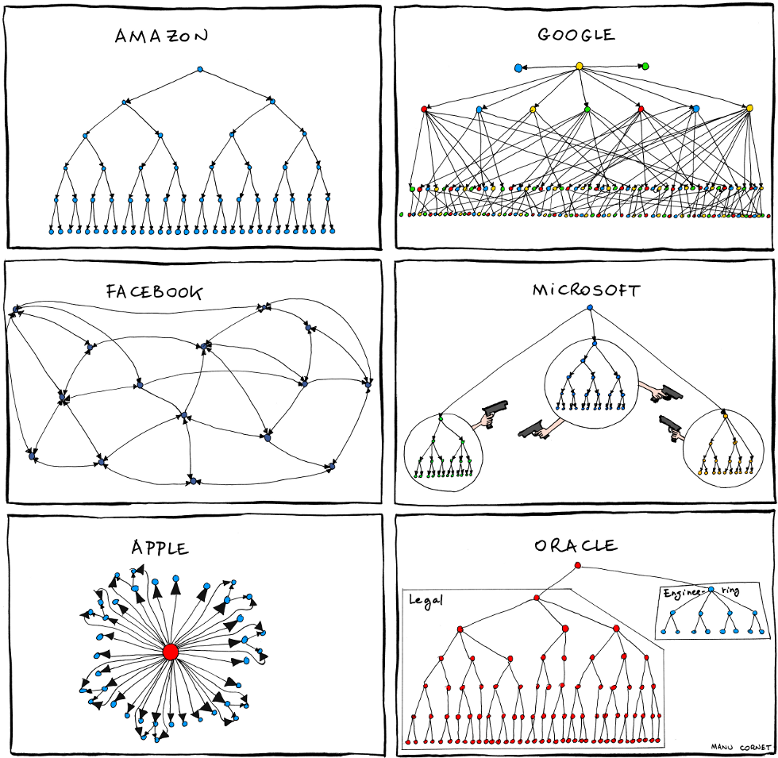

# La importancia de la comunicacion - Ley de Conway

Ley de Conway: Una empresa u organización va a poder generar, estructuras que imiten la vía de comunicación de su propia organización.

Melvin Conway en su paper “How Do Committees Invent” publicado en la revista Datamation en abril de 1986 observaba lo siguiente:

- Organizations which design systems … are constrained to produce designs which are copies of the communication structures of these organizations.
- Las organizaciones dedicadas al diseño de sistemas … están abocadas a producir diseños que son copias de las estructuras de comunicación de dichas organizaciones
dicho de otra forma:
- Cualquier pieza de software refleja la estructura organizacional que la produjo.

“Cualquier organización que diseñe un sistema producirá un diseño que copia la estructura de comunicación de dicha organización.”

Conway no dijo esta afirmación como una broma, sino con una justificación real por detrás. Este hecho es causado porque dos componentes software (p.e A y B), no pueden conectarse correctamente a menos que quien diseña y quien implementa el módulo A se comunique con quien diseñe e implemente el módulo B. Así, este problema en la forma de comunicación de la empresa se refleja en el software, ya que el desarrollo es una actividad intelectual que depende mucho de las propias personas que lo desarrollan.

Articulos:

- [Ley de conway dime como es la comunicacion en tu empresa y te dire como es el software que desarrollas](https://www.javiergarzas.com/2015/06/conway.html)
- [La ley de conway y el porque no podemos tener cosas bonitas](https://medium.com/@arturoblack/la-ley-de-conway-y-el-porque-no-podemos-tener-cosas-bonitas-bd3fc9e6c8e4)
