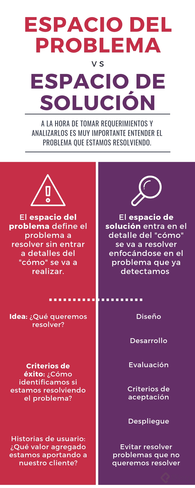

# Entender el problema

Debemos separar la **comprension del problema** y **la propuesta de solucion**.

## Espacio de comprension del problema

Es muy util narrar una historia de que es lo que queremos que el usuario pueda hacer y como lo ayudaria o le facilitaria la vida

Y nos hariamos las siguientes preguntas:
- Que quiero resolver?
- Como hago para implementar esta idea?
- Como llegaria a ser el exito de que esta idea se de?
- Que busco como criterio de exito?
- como mi usuario se beneficiaria de mi exito?

## Espacio de propuesta de solucion

- como se que lo que estamos desarrollando esta conectado?
- como puedo garantizar que los usuarios puedan hacer todo lo que estoy pensando sin errores?
- Que detalles debo solucionar?
  - Diseño
  - Desarrollo
  - Evaluacion
  - Criterios de aceptacion
  - Despliegue

**El espacio del problema**: Detalla que es lo que voy a resolver sin entrar en detalle de cómo, a la vez que imaginamos como esto va a agregar un valor a nuestros usuarios.
**El espacio de la solución**: Entra al detalle del como siempre reflejándose en el problema que detectamos, y muy importante tratando de evitar resolver problemas que no queremos resolver.

